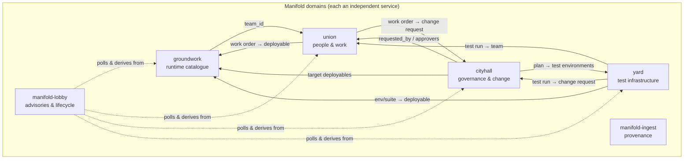
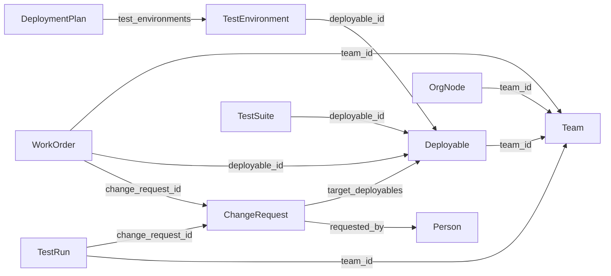
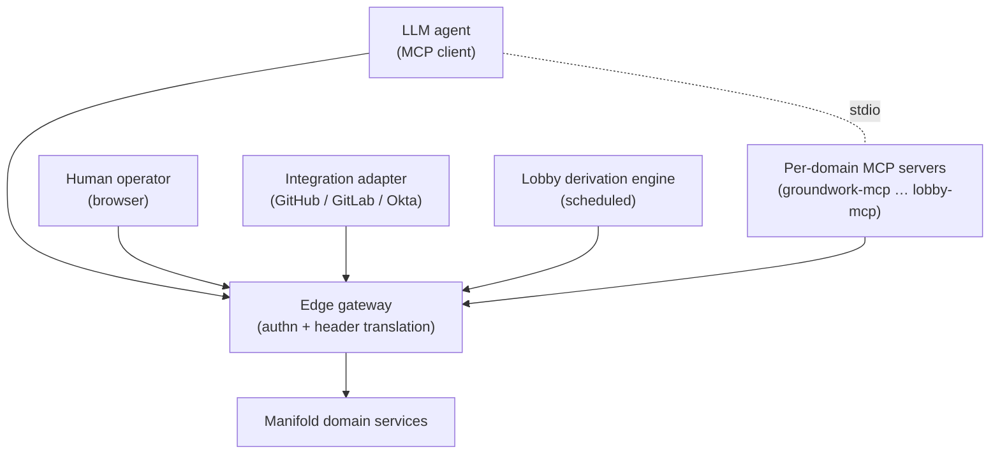

# Manifold — Conceptual Architecture

> **Status:** Living document. Captured 2026-05-31.
> **Audience:** Architects, technical evaluators, and procurement on the customer side; engineering and delivery on ours.
> **Companion documents:** Logical System Architecture — [Kubernetes](logical-system-architecture-kubernetes.md) · [Azure](logical-system-architecture-azure.md) · [AWS](logical-system-architecture-aws.md).

This document describes Manifold at the **conceptual** level: what it is for, the business
capabilities it covers, the major actors, the shape of its information model, and the
architectural principles that hold across every deployment. It is deliberately free of
platform detail — for runtime topology on a specific cloud, read the matching Logical
System Architecture (LSA).

---

## 1. What Manifold is

**Manifold is the operational knowledge graph of an engineering organisation.** It records
what software you run, who owns it, how change to it is governed, and how it is tested —
and it keeps those four concerns in one federated graph so that a question spanning all of
them ("what is the blast radius of this change, which teams does it touch, and how long did
testing it take last time?") can be answered in a single traversal.

> **Manifold is a foundation, not a turnkey product.** It is **not a PaaS** and not something
> a client self-serves into existence. It is a **reference suite plus a framework** that is
> **configured *and extended* for each client**: a delivery engagement wires up the IdP and
> policy, then adds and adapts domains, entities, federation edges, integrations, and
> derivation rules to fit that client's actual estate. The six domains described here are the
> **canonical/reference shape** — a working starting point that demonstrates the patterns —
> not a fixed feature list. Each client therefore runs **their own configured-and-extended
> distribution** of Manifold, produced by their own build (see [§5](#5-the-meshql-rs-foundation)
> and [§6](#6-architectural-principles)).

It is **back-office tooling**, not a customer-facing product. The dominant consumer is an
**LLM agent** making tens of tool calls per session through the Model Context Protocol
(MCP); humans use the same data through lightweight web UIs. The design optimises for
**responsiveness and correctness at modest scale**, not for high throughput.

Manifold is built on **[MeshQL-RS](#5-the-meshql-rs-foundation)**, a Rust framework that
gives every domain service the same shape: a write side (REST), a read side (GraphQL), and
declarative federation across services. Each Manifold domain is an independent deployable;
no service owns another's data, and cross-domain relationships are resolved at read time
over a single virtual graph. Adding a domain for a client is the *same act* as building one
of the six reference domains — define its entities, its read/write surfaces, and its
federation edges — which is what makes "extend per client" a first-class, low-ceremony
operation rather than a fork.

---

## 2. Business capabilities (the bounded contexts)

Manifold is partitioned into single-responsibility domains. Each is an independent service
("meshlette") with its own data store, its own API surface, and its own MCP server. Nothing
is co-owned; a domain that needs another domain's data **references it by id and resolves it
through federation**.

| Domain | Service | Owns the answer to… |
|--------|---------|---------------------|
| **Runtime catalogue** | `groundwork` | What software runs, what it exposes, what it depends on, and the contracts/SLAs between services. |
| **People & work** | `union` | Who works here, what teams exist, who is on them, and what work is in flight. |
| **Governance & change planning** | `cityhall` | The org hierarchy, the bylaws that gate change, change requests, deployment plans, and Gantt output. |
| **Test infrastructure** | `yard` | Test environments, the data that feeds them, run history, and the cost/time of testing change. |
| **Provenance** | `manifold-ingest` | Where each record came from — the mapping from an external system's id to Manifold's canonical id. |
| **Advisories & lifecycle** | `manifold-lobby` | What the graph implies you should act on — derived advisories, their lifecycle, programs, and saved views. |

Two supporting capabilities are not domains in their own right but are first-class parts of
the system:

- **Identity & access at the edge** (`manifold-edge` + an edge gateway) — every request
  arrives already authenticated; services trust forwarded identity and enforce
  authorisation in-process.
- **Integration / ingestion** (`manifold-integrations`) — one-shot adapters that pull from
  GitHub, GitLab, Okta and similar systems and populate the domains, recording provenance
  as they go.

### 2.1 The domains in one picture

Solid arrows are **federated read relationships** (resolved on demand at query time). Dotted
arrows show the **lobby derivation engine** reading the whole graph on a timer to produce
advisories.

---

## 3. The conceptual information model

Each domain owns a small set of entities. The relationships *between* domains are the
interesting part — they are what make Manifold a graph rather than six disconnected CRUD
apps.

### 3.1 Entities by domain

- **groundwork:** `Deployable`, `Service`, `Exposes`, `Dependency`, `Contract`, `Sla`
- **union:** `Person`, `Team`, `TeamMember`, `WorkOrder`
- **cityhall:** `OrgNode`, `Bylaw`, `ChangeRequest`, `DeploymentPlan`, `GanttOutput`
- **yard:** `TestEnvironment`, `TestInfrastructure`, `MockSource`, `DataSource`, `DataSync`, `TestRun`, `TestSuite`
- **manifold-ingest:** `Ingestion`
- **manifold-lobby:** `Advisory`, `Program`, `ProgramMembership`, `LifecycleEntry`, `SavedView`, `Comment`

The authoritative field-level definitions live in the [repository README](../../README.md)
and in each service's `config/` schemas; they are intentionally not duplicated here.

### 3.2 The federation map

Foreign keys cross domain boundaries; the owning domain never holds the foreign payload, it
holds the id and resolves the rest through the other domain's read API.

Because the relationships are resolved at read time, a single GraphQL query against one
domain can pull a connected subgraph that physically lives in three or four services — with
no shared database and no service owning another's records.

### 3.3 Conceptual cross-domain reports

The graph exists to answer questions no single domain can. The canonical examples:

- **Blast-radius gate** *(cityhall + groundwork + union)* — when planning a change, walk the
  groundwork dependency edges to find every affected deployable, then require an approval
  gate for each affected team.
- **Orphan-in-plan** *(cityhall + groundwork + union)* — if a transitively-affected
  deployable has no owning team, that is a hard blocker on the deployment plan.
- **Change-request estimate** *(yard + cityhall + groundwork)* — for a change request, find
  or recommend a test environment per target deployable and sum spin-up time, cost, and data
  sync time back into the cityhall Gantt.
- **Historical estimation** *(yard)* — group past test runs by deployable and tier to assert
  "last time this took twelve hours".
- **Orphan / overcommitment** *(union + groundwork)* — flag deployables with no team, and
  teams carrying more active work orders than their kind should bear.

These are not bespoke integrations — they are graph traversals over the federation map.

---

## 4. Actors and access channels

Manifold is read by more than one kind of consumer, and the architecture treats the agent
channel as primary.

| Actor | How they reach Manifold | What they do |
|-------|-------------------------|--------------|
| **LLM agent** | A per-domain **MCP server** (stdio binary) that calls the domain's REST/GraphQL APIs. | The primary access pattern — 20–50 tool calls per working session. |
| **Human operator** | A vanilla-JS web UI served by each domain from its own origin. | Catalogue browsing, dependency graphs, advisory triage, admin CRUD. |
| **Integration adapter** | A one-shot binary in `manifold-integrations`, run on a schedule or in CI. | Idempotently import external truth (repos, CI, directory) into the domains. |
| **Lobby derivation engine** | A background loop inside `manifold-lobby`, running as a system identity. | Poll the graph on a timer, apply rules, and raise/refresh/resolve advisories. |

Every one of these channels passes through the **edge**, and every one of them carries an
identity. There is no anonymous or unauthenticated path to the data.

---

## 5. The MeshQL-RS foundation

Every domain service is the same kind of thing, because they are all assembled from
MeshQL-RS. Understanding the framework explains most of Manifold's structure.

- **Command/Query split (CQRS-shaped).** Each entity is exposed twice: a **write side** at
  `…/api` (REST — create, update, delete, validated against JSON Schema) and a **read side**
  at `…/graph` (GraphQL — federated queries). Frontends and agents **write to `/api` and read
  from `/graph`**; the two paths never cross.
- **Meshlette = restlette + graphlette.** A domain entity's write surface (restlette) and
  read surface (graphlette) together form a "meshlette". A service is a bundle of meshlettes
  served from one Axum HTTP app.
- **Federation by configuration, not code.** A graphlette declares resolvers — "the `team`
  field on `Deployable` is resolved by calling `getById` on union's `/team/graph`". Resolvers
  can fan out over HTTP to a sibling service or resolve in-process when the services are
  co-located. There is no shared schema registry and no shared database.
- **Pluggable persistence.** The same service can be backed by SQLite (default today),
  MerkQL (an embedded append-only, tamper-evident log safe over network filesystems),
  MongoDB, or Postgres/MySQL — chosen at assembly time without changing the API.
- **One binary, many packagings.** The same `ServerConfig` can be served as a long-running
  Axum process (containers, App Service) or wrapped for AWS Lambda — same source, different
  entrypoint.
- **Schema and policy are compiled in.** Each service's entity schemas (GraphQL SDL + JSON
  Schema) and Casbin model/policy are **embedded into the binary at build time**. Defining or
  changing a domain is therefore a **build-time** activity — which is precisely why
  "configure and extend per client" produces a **per-client build/distribution**, not a
  runtime toggle. (Runtime per-customer config — IdP, header mapping, branding, and policy
  *overrides* mounted over the embedded defaults — is the exception; see
  [§6](#6-architectural-principles).)

This is why the deployment story is portable: the domains don't know or care whether they
run as Kubernetes Deployments, Azure Web Apps, or Lambda functions. That mapping is the
subject of the three LSA documents. It is also why each client's distribution is built from
the same framework but is **not byte-identical** to another client's — the domains, schemas,
and rules differ by design.

---

## 6. Architectural principles

These hold across every deployment and every customer. They are the rules a change to
Manifold must not break.

1. **Single responsibility, no co-ownership.** Each domain owns its entities outright. Cross-
   domain data is referenced by id and resolved through federation — never copied, never
   dual-written.
2. **Read/write separation.** Writes go to REST `/api` with schema validation; reads go to
   GraphQL `/graph`. Consumers respect the split.
3. **Federate over the graph.** Cross-domain questions are answered by graph traversal, not
   by a back-end-for-frontend, cross-origin REST joins, or a shared database.
4. **Authenticate at the edge, authorise in-process.** A gateway in front of the services
   performs authentication and forwards a **trusted identity header**. Services never see raw
   credentials; they read identity from configurable headers and enforce **Casbin** policy
   locally.
5. **Configure at the edge, extend at build time.** Two distinct customisation seams:
   - *Runtime config* — IdP integration, header mapping, branding, and policy overrides — is
     per-customer and lives at the edge / in mounted config. No rebuild.
   - *Extension* — new or adapted domains, entities, federation edges, integrations, and
     rules — is per-client and lives in the **build**. Each client gets their own
     configured-and-extended distribution.
   Manifold is a **foundation, not a fixed product**: the framework and the six reference
   domains are shared; what a given client runs is tailored. Do not assume one universal
   binary across all clients.
6. **Instance per tenant.** There is no multi-tenancy inside an instance. A tenant is a whole
   deployment of *that client's distribution* — either self-hosted in the customer's cloud or
   hosted by us, one instance each.
7. **Cloud-portable by construction.** The same artifact runs on Kubernetes, Azure, or AWS.
   Platform choice is the customer's; the application does not change.
8. **Agent-first, paper-second.** The latency budget belongs to MCP reads. UIs are
   deliberately thin, vanilla, accessible, and built without a framework or build step.
9. **Provenance is not optional.** Anything imported from an external system records where it
   came from in `manifold-ingest`, which makes imports idempotent and the graph auditable.

---

## 7. Cross-cutting concerns

### 7.1 Identity & authorisation

Authentication is delegated to the platform's IdP at the edge (Entra, Cognito, Okta, Auth0,
or a dev shim). The edge translates the platform's identity headers into Manifold's
**canonical headers** (`X-Manifold-User-Id`, `X-Manifold-User-Groups`). Inside each service,
`manifold-edge` lifts those headers into the request context and `CasbinAuth` enforces
role-based policy embedded per service. System actors (the lobby engine, integration
adapters) carry their own non-human identities with scoped automation roles.

### 7.2 Provenance & auditability

Every external import is logged in `manifold-ingest` as an `(external_system, external_id) →
canonical_id` mapping. Adapters consult it to decide insert-vs-update, which makes every
import idempotent and gives the graph a complete record of origin. MerkQL-backed
deployments add tamper-evidence to the underlying write log.

### 7.3 Derivation & advisories

`manifold-lobby` is the system's "what should I care about" layer. Its engine periodically
reads a snapshot of the whole graph, runs a rule set, and reconciles the result against
existing advisories — creating new ones, refreshing explanations, auto-resolving stale ones
after a quiet window, and re-raising dismissed issues that recur. Human lifecycle actions
(acknowledge, dismiss, escalate, assign, comment) are recorded as immutable lifecycle
entries.

### 7.4 Observability

Services are conventional HTTP servers exposing health endpoints; each platform LSA describes
how logs and metrics are collected there (Log Analytics, CloudWatch, or the cluster's
stack). At Manifold's scale the priority is liveness and tail-latency on reads, not
high-cardinality telemetry.

---

## 8. Quality attributes & scale envelope

Manifold is sized for back-office use. The numbers below are the design assumptions, not
limits to be defended — they shape every platform decision in the LSAs.

| Attribute | Target / assumption |
|-----------|---------------------|
| **Users** | < 100 users/day per tenant |
| **Data** | < 1 GB per tenant; working set fits in RAM |
| **Access shape** | Read-heavy; reads indexed by design; dominant consumer is MCP agents |
| **Latency** | Responsiveness over throughput; **cold starts are the enemy**, tail latency under load is not |
| **Availability** | Single-instance with fast restart is acceptable; no five-nines requirement |
| **Tenancy** | One instance per tenant; isolation is physical, not logical |
| **Portability** | Identical artifact on K8s / Azure / AWS |
| **Security** | Authenticated at the edge; no anonymous path; per-customer policy without code change |

---

## 9. What is in scope where

| Concern | Conceptual Architecture (this doc) | Logical System Architecture (per platform) |
|---------|-----------------------------------|--------------------------------------------|
| Business capabilities & domains | ✔ | recap only |
| Information model & federation | ✔ | recap only |
| Architectural principles | ✔ | applied |
| Actors & access channels | ✔ | mapped to platform ingress |
| Runtime topology, networking, storage | — | ✔ |
| Identity provider integration | named | ✔ wired |
| Build, image supply chain, CI/CD | named | ✔ |
| Scaling, availability, DR | targets | ✔ realised |
| Cost envelope | — | ✔ |

Continue to the LSA for your target platform:
**[Kubernetes](logical-system-architecture-kubernetes.md)** ·
**[Azure](logical-system-architecture-azure.md)** ·
**[AWS](logical-system-architecture-aws.md)**.
