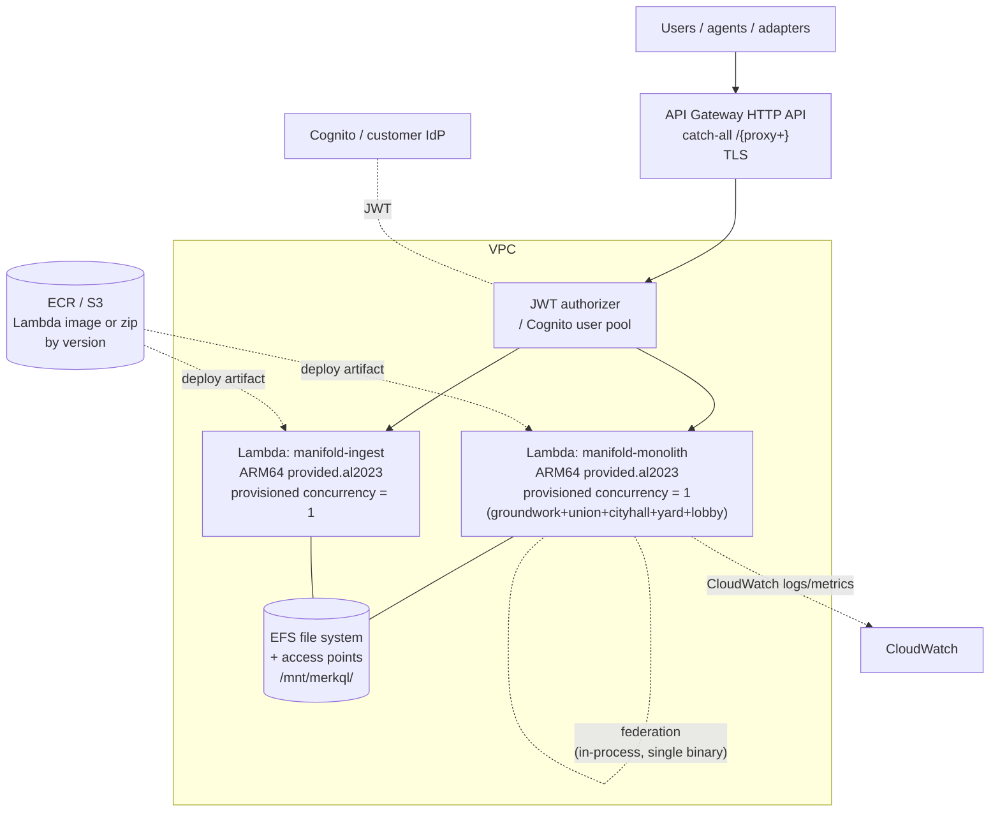

# Manifold — Logical System Architecture: AWS

> **Status:** Living document. Captured 2026-05-31.
> **Audience:** Platform engineers and architects deploying Manifold onto Amazon Web Services.
> **Reads with:** [Conceptual Architecture](conceptual-architecture.md). Sibling LSAs: [Kubernetes](logical-system-architecture-kubernetes.md) · [Azure](logical-system-architecture-azure.md).
> **Reference IaC:** `meshql-rs/examples/egg-economy-lambda/cdk/` (AWS CDK TypeScript). Background in [`docs/deployment.md`](../deployment.md).

This document maps Manifold's logical building blocks onto **AWS Lambda + API Gateway +
EFS**. It is the serverless, scale-to-zero shape — the cheapest at Manifold's traffic
profile, with the one caveat that cold starts must be engineered out.

---

## 1. Logical building blocks (platform-neutral recap)

| # | Logical block | Realised on AWS as |
|---|---------------|--------------------|
| 1 | **Edge / ingress** | API Gateway HTTP API + JWT/Cognito authorizer |
| 2 | **Domain services** | Lambda functions (ARM64, `provided.al2023`), one per domain (monolith option below) |
| 3 | **Persistence** | EFS file system + access points, mounted per function at `/mnt/merkql/<domain>` |
| 4 | **Identity** | Cognito user pool **or** customer JWT IdP via the authorizer; Casbin in-process |
| 5 | **Agent access (MCP)** | Client-side stdio binaries pointing at the API Gateway URL |
| 6 | **Integration / ingestion** | One-shot adapters as scheduled Lambdas / Fargate tasks |
| 7 | **UI** | Served by the Lambda-wrapped app (or fronted via CloudFront) |

MeshQL's `meshql-lambda` crate wraps the exact same Axum app in `lambda_http`, so the domain
code is unchanged from the container shapes — only the entrypoint differs.

---

## 2. AWS topology

The AWS shape introduces an important packaging choice that the container shapes don't force:
**how many Lambda functions**.

---

## 3. Packaging: monolith vs per-domain functions

MeshQL keeps the federation seam in source even when services are co-located, which lets the
five read/write domains be merged into **one `manifold-monolith` binary** (all routers behind
path prefixes, federation resolved **in-process** rather than over HTTP). On Lambda this is
the recommended default:

- **`manifold-monolith` Lambda** — groundwork + union + cityhall + yard + lobby in one
  function. Federation is in-process (no inter-Lambda HTTP), which removes network hops and
  halves cold-start surface.
- **`manifold-ingest` Lambda** — kept separate because it is the provenance ledger written by
  adapters and has a distinct access pattern.

> **Why merge here but not on K8s/Azure?** On Lambda, every function is a separate cold-start
> and a separate provisioned-concurrency line item. Collapsing five domains into one binary
> means **one warm instance** keeps the whole read/write surface hot for ~$2–5/mo instead of
> five. The federation boundary still exists in the source for clarity and for customers who
> later outgrow the monolith — it is a packaging decision, not an architecture change.

Per-domain Lambdas remain possible (one function per domain, federation over HTTP through API
Gateway) if a customer wants strict per-domain isolation, at higher cold-start and cost.

---

## 4. Component realisation

### 4.1 Domain compute — Lambda (ARM64, `provided.al2023`)

- Each function is the Axum app wrapped by **`meshql-lambda`** (`lambda_http::run(app)`),
  built for **ARM64** (Graviton — cheaper and slightly faster cold start than x86).
- Deployed as a Lambda **container image (ECR)** or **zip (S3)**; the reference is
  `meshql-rs/examples/egg-economy-lambda/cdk/`.
- **`PORT`/`DATA_DIR`** become Lambda env: `DATA_DIR=/mnt/merkql/<domain>` over EFS.

### 4.2 Cold starts — the one real risk, and the fix

Rust Lambda cold start is **100–300 ms even on ARM64**. At ~100 users/day the traffic is
bursty enough that Lambda scales to zero between sessions, so **every visitor would otherwise
pay the cold-start tax** — which directly violates Manifold's "responsiveness over throughput,
cold starts are the enemy" principle.

**Fix:** **provisioned concurrency = 1** on the monolith and on ingest. This keeps one warm
instance always ready, eliminating the tax, for roughly **$2–5/mo per function (~$5–10/mo
total)** — comfortably inside the budget envelope. This is non-optional for an acceptable
agent/UX experience; it is the AWS equivalent of Azure's `always_on = true`.

### 4.3 Edge / ingress — API Gateway + authorizer

- **API Gateway HTTP API** with a **catch-all `/{proxy+}`** route fronts the functions and
  terminates TLS.
- **Authentication** is a **JWT authorizer** (customer's OIDC IdP) or a **Cognito user
  pool** — chosen per customer. The authorizer validates the token at the edge; the function
  never sees raw credentials.
- **Header translation:** the authorizer / an integration mapping projects the validated
  claims into Manifold's canonical `X-Manifold-User-Id` / `X-Manifold-User-Groups` before the
  request reaches the function. (Where a customer needs the Caddy-style translation logic, a
  thin Caddy/Lambda@Edge step can sit in front, mirroring the Azure shape; for most AWS
  customers the authorizer's claim mapping suffices.)
- **Authorisation:** Casbin policy is enforced **in-process** in each function, reading the
  canonical headers — identical to every other platform.

### 4.4 Persistence — EFS

- An **EFS file system** with **access points** gives each domain an isolated directory
  (`/mnt/merkql/<domain>`), mounted into the Lambda.
- **MerkQL over EFS** is the intended store: append-only, single-writer, safe over the NFS
  mount — the same property that makes it safe over Azure Files SMB.
- EFS in **General Purpose / Bursting** mode is right-sized for < 1 GB/tenant; no provisioned
  throughput needed.
- The functions run **in the VPC** to reach EFS; provisioned concurrency keeps the
  ENI/VPC cold-start cost off the request path.

### 4.5 Integration, MCP, and UI

- **Integration adapters** run as **scheduled Lambdas** (EventBridge cron) or **Fargate
  tasks** for longer syncs; source-system tokens from Secrets Manager, Manifold automation
  identity via headers, idempotent through `manifold-ingest`.
- **MCP servers** run **client-side**, pointed at the API Gateway URL; nothing MCP-side is
  deployed to AWS.
- **UI** is served by the Lambda-wrapped app; optionally front it with **CloudFront** for
  caching of the embedded static assets and a stable custom domain.

---

## 5. Networking & traffic flow

| Hop | From → To | Protocol | Notes |
|-----|-----------|----------|-------|
| Ingress | Internet → API Gateway | HTTPS | TLS terminated at the gateway |
| Authn | API Gateway ↔ Cognito / IdP | OIDC/JWT | Authorizer validates token at edge |
| Edge → fn | API Gateway → Lambda | AWS invoke | Canonical identity headers injected |
| Federation | within monolith | in-process | No inter-Lambda hop (monolith packaging) |
| Persistence | Lambda → EFS | NFS | `/mnt/merkql/<domain>`; in-VPC |
| Telemetry | Lambda → CloudWatch | AWS | Logs + metrics |

### Optional Kafka/event path

For a future customer with genuine event-driven scale, MeshQL has an
`egg-economy-ksql` pattern (Kafka/ksqlDB). It is **out of scope at Manifold's envelope** and
flagged only as the escape hatch if a tenant outgrows the single-writer file model.

---

## 6. Build & artifact supply chain

- **Artifacts:** the same Rust workspace, built for `aarch64` Lambda and packaged as a
  container image (ECR) or zip (S3). CI extends Manifold's
  [`.gitlab-ci.yml`](../../.gitlab-ci.yml) build/test/clippy with a Lambda packaging step (the
  container shapes publish Docker images; AWS publishes Lambda artifacts).
- **IaC:** AWS CDK (TypeScript), adapted from `meshql-rs/examples/egg-economy-lambda/cdk/` —
  two functions (monolith + ingest) instead of the example's one, plus the EFS + access
  points, API Gateway, authorizer, and provisioned-concurrency config.
- **Versioning:** Lambda **versions + aliases** make rollback a pointer move; pin the API
  Gateway integration to a published version, never `$LATEST`.

---

## 7. Scaling & availability

- **Default:** one warm monolith + one warm ingest function. That meets the scale envelope
  with no cold starts.
- **Burst handling:** Lambda will spin additional *concurrent* instances under load
  automatically — but because persistence is **single-writer EFS**, concurrent writers to the
  same domain directory are a correctness hazard. At Manifold's read-heavy, low-write,
  low-concurrency profile this is effectively never hit; if a tenant's write concurrency ever
  rises, **cap reserved concurrency** on the function and/or move the hot domain to a
  networked backend (DynamoDB/Aurora via a MeshQL adapter) before relaxing the cap.
- **Availability:** Lambda is multi-AZ by default; EFS is multi-AZ. There is no single host to
  lose. Provisioned concurrency = 1 is about latency, not availability.

---

## 8. Observability

- **CloudWatch** logs and metrics per function (invocations, duration, errors, concurrency).
- **Cold-start watch:** alarm on init duration / un-provisioned invocations to confirm
  provisioned concurrency is actually covering traffic.
- **Health:** the app's `/health` route is reachable through API Gateway; provenance via
  `manifold-ingest` as on every platform.

---

## 9. Backup & disaster recovery

- **EFS** supports **AWS Backup** with point-in-time recovery; schedule it. The append-only
  log makes snapshots consistent.
- **Cross-region** copy via AWS Backup if the tenant wants geo-durability.
- **Full rebuild from source** is the backstop everywhere: re-run integration adapters;
  `manifold-ingest` provenance keeps re-import idempotent.
- **RPO** = backup cadence; **RTO** = minutes (CDK deploy + point functions at restored EFS).

---

## 10. Security boundaries

| Boundary | Control |
|----------|---------|
| Internet → API | TLS at API Gateway; authorizer blocks unauthenticated requests |
| Identity → action | Casbin policy in-function, per-tenant overridable |
| Function → EFS | IAM + access point scoping; functions in VPC, EFS not internet-reachable |
| Secrets | Source-system tokens in Secrets Manager; IdP config in the authorizer |
| Tenancy | One account (or one isolated stack) per tenant; no shared functions or EFS across tenants |
| Least privilege | Per-function IAM execution role; access point pins the domain's directory |

Per-customer **runtime** change is **authorizer/IdP config + Casbin policy overrides + CDK
context** — no rebuild. Per-client **extension** (new/adapted domains, entities, integrations,
rules) is compiled in, so each client runs **their own configured-and-extended distribution**:
the CDK *shape* is reused per client, but the Lambda artifacts are that client's own build.
Manifold is a foundation, not a turnkey product (see
[Conceptual Architecture](conceptual-architecture.md#6-architectural-principles)).

---

## 11. Cost envelope

At Manifold's scale the dominant line item is **provisioned concurrency** (deliberately,
to kill cold starts): roughly **$5–10/mo per tenant** all-in (2 functions × provisioned
concurrency + EFS + API Gateway requests + CloudWatch). EFS and API Gateway request charges
are negligible at < 100 users/day.

---

## 12. When to choose AWS

Choose this shape for **AWS-native customers**, when a **scale-to-zero / pay-per-use** cost
model is preferred, or when the customer already standardises on Lambda + API Gateway. Accept
that **provisioned concurrency is mandatory** for acceptable latency — without it, the
bursty-traffic cold-start tax breaks the UX. If the customer wants always-warm simplicity in
the Microsoft ecosystem use the [Azure LSA](logical-system-architecture-azure.md); for a
Kubernetes mandate use the [K8s LSA](logical-system-architecture-kubernetes.md).
