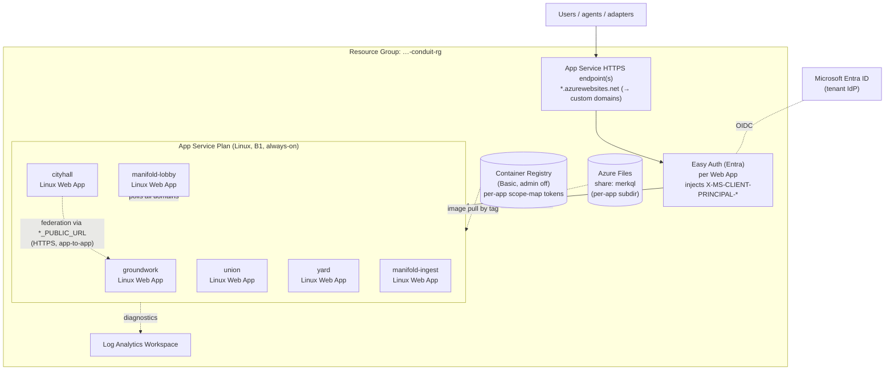

# Manifold — Logical System Architecture: Azure

> **Status:** Living document. Captured 2026-05-31. **This is the default first-customer shape** and the most battle-tested of the three.
> **Audience:** Platform engineers and architects deploying Manifold onto Microsoft Azure.
> **Reads with:** [Conceptual Architecture](conceptual-architecture.md). Sibling LSAs: [Kubernetes](logical-system-architecture-kubernetes.md) · [AWS](logical-system-architecture-aws.md).
> **Authoritative IaC:** the per-client **`conduit`** repository (`conduit/terraform/azure/`). Background and rationale in [`docs/deployment.md`](../deployment.md).

This document maps Manifold's logical building blocks onto **Azure App Service**. It is the
shape running today for the first customer (National Grid), driven by Terraform in the
`conduit` repository. Where the live `conduit` state and the target state differ, both are
called out.

---

## 1. Logical building blocks (platform-neutral recap)

| # | Logical block | Realised on Azure as |
|---|---------------|----------------------|
| 1 | **Edge / ingress** | Azure App Service built-in HTTPS + Easy Auth (Entra); Caddy edge for header translation |
| 2 | **Domain services** | 6 × `azurerm_linux_web_app` on one shared App Service Plan |
| 3 | **Persistence** | App-local disk today; **Azure Files SMB** mount per service is the durability target |
| 4 | **Identity** | Microsoft Entra ID via App Service Easy Auth; Casbin policy in-process |
| 5 | **Agent access (MCP)** | Client-side stdio binaries pointing at the public app URLs |
| 6 | **Integration / ingestion** | One-shot adapter runs (Container Apps Job / scheduled VM / CI) |
| 7 | **UI** | Served by each Web App from its own origin |

---

## 2. Azure topology



All resources sit in **one Resource Group per tenant**, named to the customer's CAF
convention. The six domains share **one App Service Plan**; each is an independent Web App
pulling its own image from the registry.

---

## 3. Component realisation

### 3.1 Domain services — 6 × Linux Web App, `for_each`-driven

The heart of the Azure shape is in `conduit/terraform/azure/`:

- **`locals_apps.tf`** is the single source of truth: a `local.apps` map with the six entries
  (`groundwork`, `cityhall`, `union`, `yard`, `manifold-lobby`, `manifold-ingest`). Each
  carries an `image_tag` (pinned per release) and an `env_fragment` (the upper-case stem used
  to build env-var names). From this map it derives CAF-compliant resource names, the
  `https://<app>.azurewebsites.net` URLs, and the per-app settings.
- **`apps.tf`** declares a single `azurerm_linux_web_app` resource with
  `for_each = local.apps`. Each Web App:
  - pulls its container image **from the registry by tag**;
  - has a **system-assigned managed identity** (held for future Key Vault / Storage access);
  - runs with **`always_on = true`** — this is the design's answer to cold starts on B1;
  - receives `PORT=3000`, `DATA_DIR=/data`, and the full set of `*_URL` / `*_PUBLIC_URL`
    cross-references so federation resolves to sibling apps.
- **Federation** between apps is **HTTPS app-to-app** over the public `*_PUBLIC_URL` values
  (`https://union.<domain>` etc.) — the same env contract as docker-compose, just with public
  URLs. There is no private VNet mesh required at this scale.

### 3.2 Compute plan

- **`app_service_plan.tf`** provisions one **Linux App Service Plan, SKU B1, always-on**,
  shared by all six Web Apps.
- **Why B1, not EP1/Premium:** Manifold needs neither Azure Functions, VNet integration, nor
  elastic scale. A B1 Linux Web App is **always warm by default** (no cold-start tax),
  supports the SMB file mount, and costs roughly an order of magnitude less than the EP1
  Premium plan the `meshql-rs/examples/farm-azure` Functions example uses. The whole tenant
  runs ~$15/mo all-in.

### 3.3 Image supply chain — Azure Container Registry + scope-map tokens

- **`acr.tf`** provisions an `azurerm_container_registry` (**Basic** SKU, admin user
  **disabled**).
- **`acr_tokens.tf`** is the notable workaround. Ideally each Web App's managed identity would
  hold `AcrPull` and pull with no secret. That role assignment is currently blocked (the
  SailPoint UAA grant is pending), so instead each app gets a **read-only ACR scope-map
  token** scoped to exactly `repositories/<app>/content/read`, with a rotating password. The
  Web App authenticates to the registry with that token.
  - This is a deliberate, documented stopgap. **Once the AcrPull grant lands, refactor back
    to managed identity + role assignment** and delete the token resources.
- Images themselves are the per-app images published by Manifold's
  [`.gitlab-ci.yml`](../../.gitlab-ci.yml) on a version tag (six-way parallel matrix, pushed
  with `--password-stdin` and an explicit `docker logout`). Conduit pulls them **by pinned
  tag**, so a rollback is a tag bump in `locals_apps.tf`.

### 3.4 Persistence

- **Target state (per [`deployment.md`](../deployment.md)):** a single **Storage Account +
  Azure Files share** (`merkql`, ~5 GB quota) with one subdirectory per domain, mounted into
  each Web App at **`/data`** over SMB. MerkQL is **append-only and safe over SMB** (single
  writer per file), which is exactly why it is the recommended store for this shape; the
  Web App writes its log to durable, snapshot-able storage independent of the compute.
- **Current state:** apps run with `DATA_DIR=/data` on app-local storage. The Azure Files
  mount + `SqliteRepository → MerkqlRepository` swap is the first-real-deploy durability item
  tracked in `deployment.md`. Until then, treat the data as ephemeral-per-instance and rely on
  re-import from source systems for recovery.
- **Why not a managed database:** at < 1 GB/tenant, read-heavy, single-writer, a file-backed
  log on Azure Files is cheaper, simpler, and snapshot-friendly. A networked DB is only worth
  it if a specific domain must scale out (see [§6](#6-scaling--availability)).

### 3.5 Identity & authorisation — Entra Easy Auth + Caddy translation

```mermaid
sequenceDiagram
    participant U as User
    participant EA as Easy Auth (Entra)
    participant Cad as Caddy edge
    participant Svc as Domain Web App
    U->>EA: HTTPS request (OIDC)
    EA->>EA: authenticate against Entra
    EA->>Cad: forward + X-MS-CLIENT-PRINCIPAL-NAME / -PRINCIPAL
    Cad->>Cad: map → X-Manifold-User-Id / X-Manifold-User-Groups
    Cad->>Svc: request + canonical headers
    Svc->>Svc: manifold-edge lifts headers; CasbinAuth enforces policy
    Svc-->>U: response
```

- **Authentication:** App Service **Easy Auth** with **Microsoft Entra ID** terminates OIDC
  and injects `X-MS-CLIENT-PRINCIPAL-NAME` (UPN) and `X-MS-CLIENT-PRINCIPAL` (claims blob).
- **Header translation:** the Caddy edge (modelled on
  [`caddy/Caddyfile.azure-entra.example`](../../caddy/Caddyfile.azure-entra.example)) maps the
  Easy Auth headers to Manifold's canonical `X-Manifold-User-Id` and `X-Manifold-User-Groups`
  (groups sourced from an Entra custom-claim / app-role mapping, since the principal blob
  isn't decoded in Caddy directly). Unauthenticated requests are rejected.
- **Authorisation:** each Web App enforces **Casbin** policy in-process via
  `CasbinAuth<StashKeyAuth>`, reading the canonical headers. Policy is embedded in the image
  and overridable per-tenant.
- A thing to **verify on first real deploy** (open item in `deployment.md`): whether Easy Auth
  emits exactly the headers expected, or whether the Caddy translation sidecar must be tuned.

### 3.6 Integration, MCP, and UI

- **Integration adapters** (`catalog-from-github`, `union-from-okta`, …) are one-shot
  binaries. On Azure run them as **Container Apps Jobs** or scheduled runs (or from CI),
  carrying source-system tokens from Key Vault and a Manifold automation identity; they call
  the public app URLs and stay idempotent via `manifold-ingest`.
- **MCP servers** run **client-side** (operator/agent machine or CI), pointed at the public
  `*.azurewebsites.net` / custom-domain URLs. Nothing MCP-related is deployed to Azure.
- **UI** is embedded in each Web App and served from that app's own origin — no separate
  static hosting, no CORS.

---

## 4. Naming & tagging — National Grid landing zone

The tenant runs inside National Grid's Azure landing zone, which **enforces two policies that
bit the first deploy** and constrain every resource name and tag:

- **`SetNamingConvention` Deny policy (CAF abbreviations).** Resource names must follow
  `{project_number}-{environment}-{region_code}-conduit-{token}-{workload}-{instance}`, where
  the `{token}` is a CAF-approved abbreviation. The policy denied both `asp` and `plan` for
  the App Service Plan; the working token turned out to be `app` (inferred from what the
  policy actually accepts). No-hyphen resources (ACR, Storage Account) use the concatenated
  form `{project_number}{env_code}{region_code}conduitacr01`.
- **18 mandatory tags.** Every resource carries the landing zone's required tag set
  (Application ID, Business Function, Cost Center, Environment, Financial/Service Owner,
  OrcaEnvironment, Project Code, ccoe-lineage, `ManagedBy=terraform`, …). These are defined
  once in `conduit`'s `main.tf` and kept in sync with the tfstate bootstrap script.

Terraform **remote state** lives in an Azure Storage account in the same landing zone; the
subscription is pinned in the backend config.

---

## 5. Networking & traffic flow

| Hop | From → To | Protocol | Notes |
|-----|-----------|----------|-------|
| Ingress | Internet → Web App | HTTPS | TLS by App Service; custom domains map to the apps |
| Authn | Web App ↔ Entra | OIDC | Easy Auth at the platform edge |
| Edge | Easy Auth → Caddy → app | HTTP (in-app) | Header translation to canonical identity |
| Federation | app → app | HTTPS | Over `*_PUBLIC_URL`; app-to-app |
| Registry | Web App → ACR | HTTPS | Pull by tag using scope-map token |
| Persistence | app → Azure Files | SMB | `/data` mount (durability target) |
| Diagnostics | app → Log Analytics | HTTPS | Logs/metrics |

No customer VNet is required at this scale; everything rides public HTTPS within the
landing-zone subscription. If a customer mandates private networking, VNet integration +
Private Endpoints for ACR/Storage is an additive change, not a redesign (and would justify
revisiting the B1-vs-Premium choice).

---

## 6. Scaling & availability

- **Default is one Web App per domain on a shared B1 plan, always-on.** That meets the scale
  envelope (< 100 users/day, < 1 GB/tenant) with no cold starts.
- **Vertical first:** if a domain needs more, move the plan to B2/B3 or give the hot domain
  its own plan — a Terraform variable change.
- **Horizontal scale-out is gated by persistence.** With file-backed single-writer storage on
  Azure Files, **do not** run multiple instances of one Web App against the same data
  directory. To scale a domain out, first switch that domain to a networked backend (Azure
  Database for PostgreSQL via the MeshQL adapter), then enable App Service autoscale for that
  app only.
- **Availability** is "always-on single instance + fast restart". App Service health checks
  recycle an unhealthy instance automatically; that is inside the back-office tolerance.

---

## 7. Observability

- **Diagnostics** stream to a **Log Analytics Workspace** in the resource group.
- **Health** endpoints per app feed App Service health checks.
- **Audit:** every request carries canonical identity headers; `manifold-ingest` is the
  provenance trail for imported data.

---

## 8. Backup & disaster recovery

- **With the Azure Files target:** enable **share snapshots** (point-in-time, consistent
  against the append-only log) on a schedule; restore by reverting/copying the share and
  re-deploying the Web Apps at the matching image tag.
- **Storage account redundancy** (LRS → ZRS/GRS) is a one-line change if the tenant wants
  cross-zone/region durability.
- **Full rebuild from source** remains the backstop: re-run the integration adapters;
  provenance keeps re-import idempotent.
- **RPO** = snapshot cadence (hourly/daily ample); **RTO** = minutes (Terraform apply +
  image pull).

---

## 9. Security boundaries

| Boundary | Control |
|----------|---------|
| Internet → app | TLS at App Service; Easy Auth blocks unauthenticated requests |
| Identity → action | Casbin policy in each app, per-tenant overridable |
| App → registry | Read-only scope-map token, least-privilege per repo (MI + AcrPull is the target) |
| Secrets | Source-system tokens and rotating registry passwords managed in Terraform / Key Vault, never in images |
| Tenancy | One resource group + one app set per tenant; no shared compute or data across tenants |
| Compliance | Landing-zone Deny policy on naming + 18 mandatory tags enforced at provision time |

Per-customer **runtime** change is **edge config (Easy Auth IdP, header mapping) + Casbin
policy overrides + Terraform variables** — no rebuild. Per-client **extension** (new/adapted
domains, entities, integrations, rules) is compiled in, so each client runs **their own
configured-and-extended distribution**: the `conduit` Terraform *shape* is reused per client,
but the images it pulls are that client's own build. Manifold is a foundation, not a turnkey
product (see [Conceptual Architecture](conceptual-architecture.md#6-architectural-principles)).

---

## 10. Open items for the first real deploy

Tracked in [`docs/deployment.md`](../deployment.md); the Azure-specific ones:

1. Mount **Azure Files** at `/data` and swap each domain to **MerkqlRepository** for durable
   persistence.
2. Confirm **Easy Auth** emits the expected headers (or tune the Caddy translation).
3. Measure **app-to-app federation latency** over public HTTPS under MCP load.
4. Replace the **ACR scope-map token** workaround with managed identity + `AcrPull` once the
   landing-zone grant lands.
5. Establish the **share-snapshot backup** policy and a restore drill.

---

## 11. When to choose Azure

This is the **default**: choose it for customers in the Microsoft ecosystem, for the National
Grid landing zone (where it is already running), and whenever "cheap, always-warm, low-ops"
matters more than elastic scale. For a Kubernetes-mandated estate use the
[K8s LSA](logical-system-architecture-kubernetes.md); for an AWS-native, scale-to-zero cost
profile use the [AWS LSA](logical-system-architecture-aws.md).
