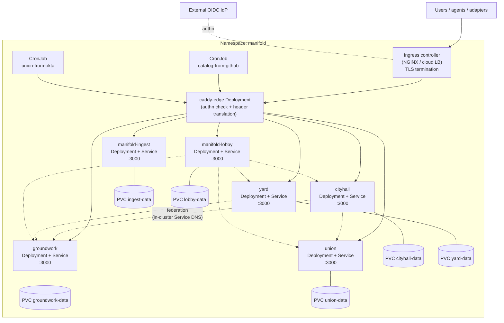

# Manifold — Logical System Architecture: Kubernetes

> **Status:** Living document. Captured 2026-05-31.
> **Audience:** Platform engineers and architects deploying Manifold onto a Kubernetes cluster (EKS, AKS, GKE, or on-prem).
> **Reads with:** [Conceptual Architecture](conceptual-architecture.md). Sibling LSAs: [Azure](logical-system-architecture-azure.md) · [AWS](logical-system-architecture-aws.md).

This document maps Manifold's logical building blocks onto a **Kubernetes** runtime. It
assumes the reader already understands *what* Manifold is from the Conceptual Architecture;
here we describe *how it runs* on a cluster.

Kubernetes is the **portability target and the "customer mandates K8s" path**. It is not the
cheapest shape for Manifold's scale (a single small node would do), but it is the most
neutral and the easiest to drop into an existing platform team's world.

---

## 1. Logical building blocks (platform-neutral recap)

Every Manifold deployment, regardless of platform, is the same seven logical tiers:

| # | Logical block | What it is | Realised on K8s as |
|---|---------------|-----------|--------------------|
| 1 | **Edge / ingress** | Authentication + identity-header translation + path routing | Ingress controller + Caddy edge `Deployment` |
| 2 | **Domain services** | The 6 meshlettes (groundwork, union, cityhall, yard, ingest, lobby) | 6 `Deployment`s + `Service`s |
| 3 | **Persistence** | Per-service append-only / embedded store | `PersistentVolumeClaim` per service (RWO) |
| 4 | **Identity** | The IdP that authenticates users; Casbin policy in-process | External OIDC IdP + per-service `ConfigMap` policy |
| 5 | **Agent access (MCP)** | Per-domain stdio MCP servers | Run client-side; **not** deployed to the cluster |
| 6 | **Integration / ingestion** | One-shot adapters (GitHub/GitLab/Okta → domains) | `CronJob`s / one-shot `Job`s |
| 7 | **UI** | Vanilla-JS frontends, embedded in each service binary | Served by the domain services themselves |

The domain services are stateless request handlers over stateful volumes; the only stateful
thing in the cluster is the set of per-service PersistentVolumes.

---

## 2. Cluster topology

Everything lives in a single `manifold` **namespace** per tenant. Cross-domain federation
traffic stays inside the cluster and resolves over Kubernetes Service DNS
(`http://union:3000`, `http://groundwork:3000`, …) — exactly the URLs the services already
use in `docker-compose.yml`, so no code change is needed.

---

## 3. Component realisation

### 3.1 Domain services (6 × Deployment + Service)

Each domain is one container image (built per-app from the shared
[`Dockerfile`](../../Dockerfile), `--build-arg APP=<name>`), exposed on container port
`3000`.

- **Workload:** one `Deployment` per domain. **`replicas: 1`** is the correct default —
  MeshQL's embedded/append-log persistence assumes a **single writer per file**, so the
  services must not be horizontally scaled while sharing a single ReadWriteOnce volume. (See
  [§6 Scaling](#6-scaling--availability) for the path to more.)
- **Networking:** a `ClusterIP` `Service` per domain named exactly `groundwork`, `union`,
  `cityhall`, `yard`, `manifold-ingest`, `manifold-lobby` so in-cluster federation URLs
  resolve.
- **Config:** federation URLs and public URLs come from environment, sourced from a shared
  `ConfigMap` (the same `*_URL` / `*_PUBLIC_URL` keys as docker-compose). `DATA_DIR=/data`,
  `PORT=3000`.
- **Health:** `readinessProbe` and `livenessProbe` on the service's `/health` endpoint.
- **Resources:** small — `requests: 64Mi / 50m`, `limits: 256Mi / 500m` is ample at the
  scale envelope. The lobby derivation engine wants slightly more headroom for its periodic
  graph snapshot.

### 3.2 Edge / ingress

Two layers:

1. **Ingress controller** (NGINX or the cloud provider's) terminates TLS for the tenant's
   hostname(s) and routes to the Caddy edge Service.
2. **Caddy edge `Deployment`** runs the production Caddyfile (modelled on
   [`caddy/Caddyfile.azure-entra.example`](../../caddy/Caddyfile.azure-entra.example),
   re-pointed at the cluster's IdP). It rejects unauthenticated requests and translates the
   IdP's identity headers into Manifold's canonical `X-Manifold-User-Id` /
   `X-Manifold-User-Groups`, then path-routes to the domain Services.

For a cluster with an authenticating ingress (e.g. `oauth2-proxy` as an ingress auth
sidecar, or an IdP-aware ingress), the Caddy edge can be collapsed into the ingress layer;
keeping it explicit preserves parity with the Azure/AWS shapes and keeps header translation
in one well-understood place.

> **Routing note:** in dev/compose the edge uses **path-style** routing
> (`/groundwork/*`, `/union/*`, …). On a real cluster prefer **host-style** routing
> (`groundwork.<tenant>.example`, …) via separate Ingress rules, matching the
> `*.tildarc.com` production pattern. Either works; host-style keeps each app on its own
> origin, which the UIs assume.

### 3.3 Persistence

- One **`PersistentVolumeClaim` per domain** (`ReadWriteOnce`), mounted at `/data`.
- Backing storage class is the cluster's default block storage (EBS on EKS, Azure Disk on
  AKS, PD on GKE, or Ceph/local-path on-prem).
- **Why RWO, not RWX:** the persistence layer (SQLite or MerkQL) is single-writer; a
  ReadWriteOnce volume bound to a single pod is exactly the right constraint and the cheapest
  reliable option. Do **not** put these on a shared `ReadWriteMany` volume with multiple
  replicas.
- `StatefulSet` is an acceptable alternative to `Deployment` if you prefer stable volume
  identity; with `replicas: 1` the practical difference is small.

### 3.4 Identity & authorisation

- **Authentication:** an external OIDC IdP (the customer's). The ingress or Caddy edge is
  the OIDC relying party; downstream services never see tokens.
- **Header mapping:** set per-tenant via edge config / env (`MANIFOLD_USER_HEADER`,
  `MANIFOLD_GROUPS_HEADER`).
- **Authorisation:** each service enforces **Casbin** policy in-process. The Casbin model and
  policy ship embedded in the image but can be overridden per-tenant by mounting a
  `ConfigMap` over `config/auth/policy.csv` — policy changes without rebuilding the image.
- **System identities:** the lobby engine and integration CronJobs carry non-human
  `MANIFOLD_USER_ID` / `MANIFOLD_USER_GROUPS` values with scoped automation roles, injected
  as env (lobby) or trusted headers (adapters).

### 3.5 Integration / ingestion

The `manifold-integrations` adapters (`catalog-from-github`, `catalog-from-gitlab`,
`union-from-okta`, `yard-from-github`, `yard-from-gitlab`) are **one-shot binaries**, not
servers. On Kubernetes:

- Schedule each as a **`CronJob`** (e.g. nightly directory/catalogue sync), or run as a
  one-shot **`Job`** on demand.
- Source-system credentials (PATs, Okta API tokens) come from `Secret`s; the adapter's
  Manifold identity comes from env.
- Adapters call the **edge** (or the target Service directly, in-cluster) and use
  `manifold-ingest` to stay idempotent.

### 3.6 Agent access (MCP)

The per-domain MCP servers (`groundwork-mcp`, …) are **stdio binaries that run on the
operator's / agent's machine or CI runner**, not in the cluster. They point at the public
ingress URLs and carry a `MANIFOLD_USER_ID`. There is nothing to deploy cluster-side for the
agent channel — the cluster only needs to expose the domain HTTP APIs through the edge.

---

## 4. Networking & traffic flow

| Hop | From → To | Protocol | Notes |
|-----|-----------|----------|-------|
| Ingress | Internet → Ingress controller | HTTPS | TLS terminated here (cert-manager / cloud cert) |
| Authn | Ingress/Caddy ↔ OIDC IdP | OIDC | Redirect/JWT flow at the edge only |
| Edge → app | Caddy → domain Service | HTTP | Adds canonical identity headers |
| Federation | domain → domain Service | HTTP | In-cluster Service DNS; read-side fan-out |
| Persistence | domain → PVC | filesystem | RWO volume at `/data` |

Network policy (optional but recommended): deny-all by default in the `manifold` namespace,
then allow ingress→edge, edge→domains, and domain→domain on `:3000`. The IdP is the only
required egress (plus the source systems for integration Jobs).

---

## 5. Build & image supply chain

- **Images:** one image per domain, produced by the shared multi-stage
  [`Dockerfile`](../../Dockerfile). A dependency-cache stage keeps source edits from
  recompiling the whole workspace; the runtime stage is `debian:bookworm-slim` running as an
  unprivileged user, exposing `:3000`, reading/writing `/data`.
- **CI:** [`.gitlab-ci.yml`](../../.gitlab-ci.yml) builds, tests, and clippy-lints the
  workspace, then on a version tag publishes **six per-app images** to the container registry
  (parallel matrix). Deploy pulls images **by tag**.
- **Registry:** any OCI registry the cluster can pull from (the project ships GitLab
  Container Registry; on EKS/AKS use ECR/ACR as convenient). Image tags are pinned per
  release, never `latest`, so a rollback is a tag change.
- **Manifests:** plain YAML or a small Helm chart / Kustomize base — 6 Deployments, 6
  Services, 6 PVCs, 1 edge Deployment, 1 ConfigMap, Secrets, Ingress, and the integration
  CronJobs. The logistics k8s example under `meshql-rs/examples/` is the reference manifest
  shape (Deployment + Service + ConfigMap + ingress).

---

## 6. Scaling & availability

Manifold's scale envelope (< 100 users/day, < 1 GB/tenant, read-heavy) means **a single
replica per domain on a single small node meets the requirement**. The architecture is
explicit about why you do *not* reflexively scale out:

- **Single-writer persistence.** SQLite/MerkQL assume one writer per file. Running
  `replicas: 2` against one RWO volume is a correctness bug, not a capacity win.
- **Availability** comes from **fast restart**, not redundancy: liveness probes plus the
  Deployment controller reschedule a crashed pod in seconds, which is well inside the tail-
  latency tolerance for back-office tooling.
- **If a domain genuinely needs to scale reads**, the path is to switch that domain's
  persistence to a networked backend (MongoDB or Postgres via the MeshQL adapter) and *then*
  run multiple stateless replicas behind the Service — a per-domain decision, not a default.
- **Vertical headroom** is the first lever: bump CPU/memory limits before adding replicas.

For higher availability without changing persistence: pin each domain to a node with a
PodDisruptionBudget of 1 and rely on the cluster rescheduling onto a healthy node with the
volume re-attached.

---

## 7. Observability

- **Health:** `/health` on each domain, wired to readiness/liveness probes.
- **Logs:** stdout/stderr collected by the cluster's log stack (Fluent Bit → Loki/ELK, or
  the cloud provider's). Identity is on every request via the canonical headers, so access
  is auditable.
- **Metrics:** scrape pod/container metrics via the cluster's Prometheus; at this scale the
  signals that matter are pod liveness, restart count, and read-path latency.
- **Provenance:** `manifold-ingest` is itself the audit trail for imported data — query it
  for "where did this record come from".

---

## 8. Backup & disaster recovery

- **State** is entirely in the six PVCs. Back up by **volume snapshot** (CSI
  `VolumeSnapshot`) on a schedule, or by `rsync`/`tar` of the `/data` directory of each pod.
  MerkQL's log is append-only, so snapshots are consistent point-in-time copies.
- **Restore** is: provision fresh PVCs from snapshots, then roll out the Deployments at the
  matching image tag.
- **Tenant rebuild** from source systems is also possible end-to-end: re-run the integration
  Jobs; provenance in `manifold-ingest` keeps the re-import idempotent. This is a true DR
  backstop, not just a backup-restore.
- **RPO/RTO:** snapshot cadence sets RPO (hourly/daily is ample for back-office data); RTO is
  minutes — provision volumes + roll out.

---

## 9. Security boundaries

| Boundary | Control |
|----------|---------|
| Internet → cluster | TLS at ingress; only the edge/ingress is internet-exposed |
| Unauthenticated → data | Edge rejects requests without a valid IdP identity |
| Service → service | In-cluster only; optional NetworkPolicy deny-by-default |
| Identity → action | Casbin policy enforced in each service; per-tenant policy via ConfigMap |
| Secrets | IdP creds and source-system tokens in `Secret`s, never in images |
| Workload | Non-root container user; read-only root FS feasible (only `/data` is writable) |

Per-customer **runtime** change — IdP, header mapping, roles, policy overrides — is **edge +
ConfigMap**, no rebuild. Per-client **extension** — new/adapted domains, entities,
integrations, rules — is compiled in, so each client runs **their own configured-and-extended
distribution** built from the shared Manifold framework (see the
[Conceptual Architecture](conceptual-architecture.md#6-architectural-principles)). The
*manifest shape* on Kubernetes is identical across clients and platforms; the *images
themselves* are per-client builds. Manifold is a foundation, not a turnkey product.

---

## 10. When to choose Kubernetes

Choose this shape when **the customer already runs Kubernetes and mandates it**, when you
want a single neutral target across multiple clouds, or when Manifold must sit beside other
workloads under one platform team's operational model. If the customer has no Kubernetes
estate, the [Azure App Service](logical-system-architecture-azure.md) or
[AWS Lambda](logical-system-architecture-aws.md) shapes are cheaper and lower-operational-
burden for Manifold's scale.
